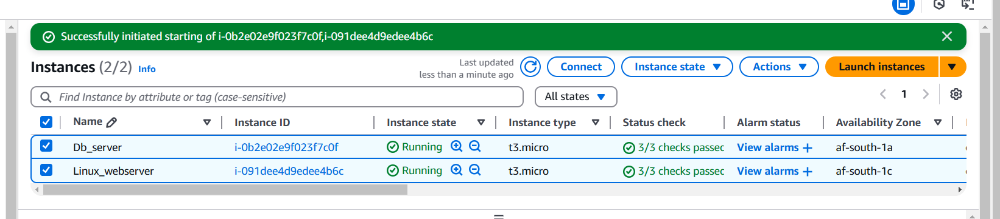
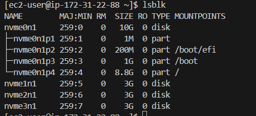
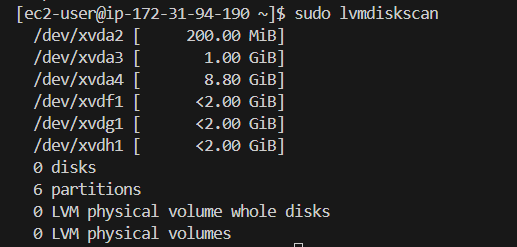
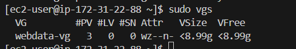
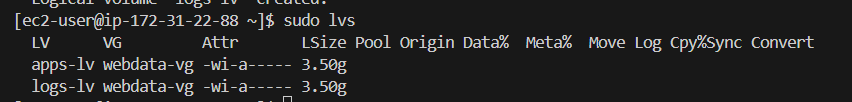

# WEB_SOLUTION_WITH_WORDPRESS

## Preparing storage infrastructure on two Linux servers and implementing a basic WEB SOLUTION USING WORDPRESS

### Introdution:

This project involves preparing storage infrastructure on two Linux servers and implement a basic web solution using WORDPRESS.

WORDPRESS is a free and open-source content management system written in PHP and paired with MySQL or MariaDB as its backend Relational
Database Management System (RDBMS).

It consists of two parts:

1. Configure storage subsystem for Web and Database servers based on Linux OS. The focus of
   this part is to give you practical experience of working with disks, partitions and volumes in
   Linux.

2. Install WordPress and connect it to a remote MySQL database server. This part of the project
   will solidify your skills of deploying Web and DB tiers of Web solution.

Generally, web, or mobile solutions are implemented based on what is called the **Three-tier Architecture.**

Three-tier Architecture is a client-server software architecture pattern that comprise of 3 separate layers.

In this project will be implementing this solution based on what is called the **Three-tier Architecture.**

**Three-tier Architecture** is a client-server software architecture pattern that comprise of 3 separate layers.

## PREREQUISITE

### The 3-Tier Setup

1. A Laptop or PC to serve as a client.
2. An EC2 Linux Server as a web server with 3 EBS Volumes: 10GB each(This is where you will install WordPress).
3. An EC2 Linux server as a database (DB) server with 3 EBS Volumes: 10GB each.

### STEPS

1. Configure storage subsystem for Web and Database servers based on Linux OS.
2. Install WordPress and connect it to a remote MySQL database server.

## Steps Involved:

- **Step 0:** Preparing Prerequisite. Creating Two AWS EC2 instances account with Red Hat Enterprise Linux 9.4.
- **Step 1:** Prepare a Web server
- **Step 2:** Prepare a Database Server
- **Step 3:** Install Wordpress on the Web Server EC2
- **Step 4:** Install MySQL on the DB Server EC2
- **Step 5:** Configure DB to work with WordPress
- **Step 6:** Configure WordPress to connect to remote database.

## Step 0: Preparing Prerequisite.

Create Two AWS EC2 instances account with Red Hat Enterprise Linux 9.4.

- A Web Server Instance
- A DB Server Instance

## Step 1: Prepare a Web server

1. In the Web Server EC2, create 3 volumes each of 10GB
2. Attach all 3 volumes to the Web Server EC2 instance

3.  Inspect the Block devices

             lsblk

    

4.  Create a single Partition on each of the 3 disks using gdisk utility

             sudo gdisk /dev/nvme1n1
             sudo gdisk /dev/nvme2n1
             sudo gdisk /dev/nvme3n1

5.  Use 1sblk utility to view the newly configured partition on each of the 3 disks.

         lsblk

6. Install Logical Volume Manager 2

LVM2 (Logical Volume Manager version 2) is a storage management system used in Linux to create flexible and scalable disk partitions. It allows you to manage disk space more efficiently compared to traditional partitioning methods.

         sudo yum install lvm2

Run `sudo lvmdiskscan` command to check for available partition

         sudo lvmdiskscan

7.  Create Physical Volumes using pvcreate and verify using `sudo pvs`

         sudo pvcreate /dev/nvme1n1 /dev/nvme2n1 /dev/nvme3n1

         sudo pvs

8.  Add all 3 PVs to a volume group (VG) using vgcreate utility. Name the VG **webdata-vg**. Verify it using `sudo vgs`

         sudo vgcreate webdata-vg /dev/nvme3n1p1 /dev/nvme2n1p1 /dev/nvme1n1p1

         sudo vgs

9.  Craate 2 Logical Volumes **apps-Iv** (Use half of the PV size), and **logs-Iv** Use the remaining space of the PV size. Use `sudo lvs` to verify.
    _NOTE: apps-lv will be used to store data for the Website while, logs-Iv will be used to store data for logs._

         sudo lvcreate -n apps-lv -L 14G webdata-vg
         sudo lvcreate -n logs-lv -L 14G webdata-vg
         sudo lvs

