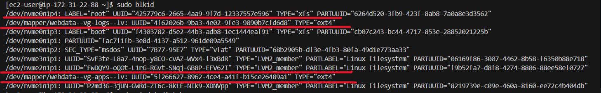
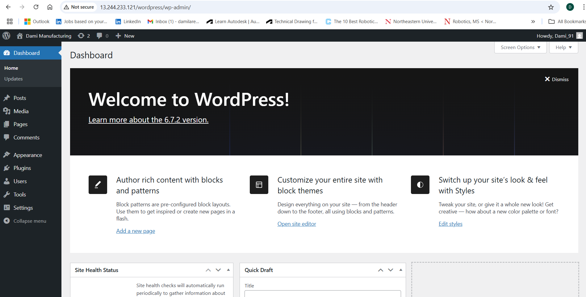

# WEB_SOLUTION_WITH_WORDPRESS

## Preparing storage infrastructure on two Linux servers and implementing a basic WEB SOLUTION USING WORDPRESS

### Introdution:

This project involves preparing storage infrastructure on two Linux servers and implement a basic web solution using WORDPRESS.

WORDPRESS is a free and open-source content management system written in PHP and paired with MySQL or MariaDB as its backend Relational
Database Management System (RDBMS).

It consists of two parts:

1. Configure storage subsystem for Web and Database servers based on Linux OS. The focus of
   this part is to give you practical experience of working with disks, partitions and volumes in
   Linux.

2. Install WordPress and connect it to a remote MySQL database server. This part of the project
   will solidify your skills of deploying Web and DB tiers of Web solution.

Generally, web, or mobile solutions are implemented based on what is called the **Three-tier Architecture.**

Three-tier Architecture is a client-server software architecture pattern that comprise of 3 separate layers.

In this project will be implementing this solution based on what is called the **Three-tier Architecture.**

**Three-tier Architecture** is a client-server software architecture pattern that comprise of 3 separate layers.

## PREREQUISITE

### The 3-Tier Setup

1. A Laptop or PC to serve as a client.
2. An EC2 Linux Server as a web server with 3 EBS Volumes: 10GB each(This is where you will install WordPress).
3. An EC2 Linux server as a database (DB) server with 3 EBS Volumes: 10GB each.

### STEPS

1. Configure storage subsystem for Web and Database servers based on Linux OS.
2. Install WordPress and connect it to a remote MySQL database server.

## Steps Involved:

- **Step 0:** Preparing Prerequisite. Creating Two AWS EC2 instances account with Red Hat Enterprise Linux 9.4.
- **Step 1:** Prepare a Web server
- **Step 2:** Prepare a Database Server
- **Step 3:** Install Wordpress on the Web Server EC2
- **Step 4:** Install MySQL on the DB Server EC2
- **Step 5:** Configure DB to work with WordPress
- **Step 6:** Configure WordPress to connect to remote database.

## Step 0: Preparing Prerequisite.

Create Two AWS EC2 instances account with Red Hat Enterprise Linux 9.4.

- A Web Server Instance
- A DB Server Instance

## Step 1: Prepare a Web server

1. In the Web Server EC2, create 3 volumes each of 10GB
2. Attach all 3 volumes to the Web Server EC2 instance

3.  Inspect the Block devices

             lsblk

    

4.  Create a single Partition on each of the 3 disks using gdisk utility

             sudo gdisk /dev/nvme1n1
             sudo gdisk /dev/nvme2n1
             sudo gdisk /dev/nvme3n1

5.  Use 1sblk utility to view the newly configured partition on each of the 3 disks.

         lsblk

6. Install Logical Volume Manager 2

LVM2 (Logical Volume Manager version 2) is a storage management system used in Linux to create flexible and scalable disk partitions. It allows you to manage disk space more efficiently compared to traditional partitioning methods.

         sudo yum install lvm2

Run `sudo lvmdiskscan` command to check for available partition

         sudo lvmdiskscan

7.  Create Physical Volumes using pvcreate and verify using `sudo pvs`

         sudo pvcreate /dev/nvme1n1 /dev/nvme2n1 /dev/nvme3n1

         sudo pvs

8.  Add all 3 PVs to a volume group (VG) using vgcreate utility. Name the VG **webdata-vg**. Verify it using `sudo vgs`

         sudo vgcreate webdata-vg /dev/nvme3n1p1 /dev/nvme2n1p1 /dev/nvme1n1p1

         sudo vgs

9.  Craate 2 Logical Volumes **apps-Iv** (Use half of the PV size), and **logs-Iv** Use the remaining space of the PV size. Use `sudo lvs` to verify.
    _NOTE: apps-lv will be used to store data for the Website while, logs-Iv will be used to store data for logs._

         sudo lvcreate -n apps-lv -L 14G webdata-vg
         sudo lvcreate -n logs-lv -L 14G webdata-vg
         sudo lvs

10. Verify the entire setup

         sudo vgdisplay -v #view complete setup - VG, PV, and LV
         sudo 1sblk

11. Use mkfs.ext4 to format the logical volumes with ext4 filesystem

         sudo mkfs -t ext4 /dev/webdata-vg/apps-lv
         sudo mkfs -t ext4 /dev/webdata-vg/logs-lv

Outcome:

12. Create /var/www/html directory to store website files

         sudo mkdir -p /var/www/html

13. Create /home/recovery/logs to store backup of log data

         sudo mkdir -p /home/recovery/logs

14. Mount /var/www/html on apps-lv logical volume

         sudo mount /dev/webdata-vg/apps-lv /var/www/html/

15. Use rsync utility to backup all the files in the log directory _/var/log_ into _/home/recovery/logs_ (This is required before mounting the filesystem)

         sudo rsync -av /var/log/ /home/recovery/logs/

16. Mount _/var/log_ on _logs-lv_ logical volume. (Note that all the existing data on /var/log will be deleted.)

         sudo mount /dev/webdata-vg/logs-lv /var/log

17. Restore log files back into _/var/log_ directory

         sudo rsync -av /home/recovery/logs/ /var/log

18. Update /etc/fstab file so that the mount configuration will persist after restart of the server.

    The UUID of the device will be used to update the /etc/fstab file;

         sudo blkid

19. Update /etc/fstab in this format using your own UUID and rememeber to remove the leading and ending quotes.

         sudo vi /etc/fstab

Paste the code below

**Mount for word press**

      UUID="4f62026b-9ba3-4e02-9fe3-9890b7cfd6d8" /var/log ext4 defaults 0 0

      UUID="5f266627-8962-4ce4-a41f-b15ce26489a1" /var/www/html ext4 defaults 0 0

20. Test the configuration and reload the daemon

         sudo mount -a

         sudo systemctl daemon-reload

21. Verify your setup by running df -h, output must look like this:

## Step 2: Prepare a Database server

Launch a second RedHat EC2 instance that will have a role - 'DB Server' Repeat the same steps asfor the Web Server, but instead of apps-lv create db-lv and mount it to /db directory instead
of /var/www/html/.

## Step 3: Install WordPress on the Web Server EC2

### Install Apache httpd

1.  Update the repository

         sudo yum -y update

2.  Install wget, Apache and it's dependencies

         sudo yum -y install wget httpd php php-mysqlnd php-fpm php-json

3.  Start Apache

         sudo systemctl enable httpd

         sudo systemctl start httpd

4.  Check that Apache is running:

         sudo systemctl status httpd

5. Access the web browser: http://your-server-ip

If everything is configured correctly, you should see the default redhat page.

### Install PHP and it's dependencies

6.  This command installs the EPEL (Extra Packages for Enterprise Linux) repository on a CentOS 8 / RHEL 8.

         sudo yum install https://dl.fedoraproject.org/pub/epel/epel-release-latest-8.noarch.rpm

7.  This command installs the Remi repository and YUM utilities on a CentOS 8 / RHEL 8.

         sudo yum install yum-utils http://rpms.remirepo.net/enterprise/remi-release-8.rpm

8.  Enable the module stream for PHP 8.3:

         sudo yum module switch-to php:remi-8.3

9.  Install the module stream for PHP 8.3 with default extension:

         sudo yum module install php:remi-8.3

10. Install PHP 8.3 and the necessary extensions for WordPress:

         sudo yum install php php-opcache php-gd php-curl php-mysqlnd php-xml php-json php-mbstring php-intl php-soap php-zip

11. Start and enable PHP-FPM:

         sudo systemctl start php-fpm

         sudo systemctl enable php-fpm

### Restart Apache

12. Restart Apache to apply the changes:

         sudo systemctl restart httpd

### Download wordpress and copy wordpress to /var/www/html

13. Install the wget package

         sudo dnf install wget

14. Download the latest version of WordPress:

         sudo wget https://wordpress.org/latest.tar.gz

15. Extract the WordPress archive:

         sudo tar -xzvf latest.tar.gz

         sudo rm latest.tar.gz

16. Move WordPress folder to your Apache web root:

         sudo mv wordpress/ /var/www/html/

### Configure SELinux Policies and Set the correct permissions for the Apache user:

17. Check SELinux Status

Verify that SELinux is enabled and in enforcing mode:

         sestatus

**Expected output:**

Set the correct permissions for the Apache user:

         sudo chown -R apache:apache /var/www/html/wordpress

         sudo chmod -R 755 /var/www/html/wordpress

         sudo chcon -t httpd_sys_rw_content_t  /var/www/html/wordpress -Rv

18. Restart Apache to apply the changes:

         sudo systemctl restart httpd

## Step 4: Install MySQL on the DB Server EC2

         sudo yum update

         sudo yum install mysql-server

1.  Start and enable the MySQL service:

         sudo systemctl start mysqld

         sudo systemctl enable mysqld

2.  Verify that the service is up and running by using

         sudo systemctl status mysqld

**Output**

## Step 5- Configure WordPress to connect to remote database.

Open MySQL port 3306 on DB Server EC2. For extra security, allow access to the DB server ONLY from your Web Server's IP address, so in the Inbound Rule
configuration specify source as /32

## Step 6- Configure DB to work with WordPress

1.  Create admin user for the wordpress application:

         sudo mysql -u root -p

         CREATE DATABASE wordpress;

         CREATE USER `myuser' @'<Web-Server-Private-IP-Address>` IDENTIFIED BY 'your password';

         GRANT ALL ON wordpress .* TO 'myuser' @'<Web-Server-Private-IP-Address>';

         FLUSH PRIVILEGES;

         SHOW DATABASES;

**Output**

         exit

### Access the WordPress link from the browser

         http://<Web-Server-Public-IP-Address>/wordpress/

**Fill out the DB credentials**

## Conclusion

At this point, the infrastructure was set up with WordPress and MySQL on separate EC2 instances, using EBS volumes managed by LVM for flexible storage.
